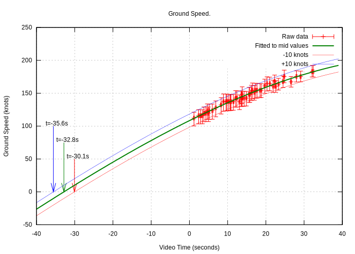
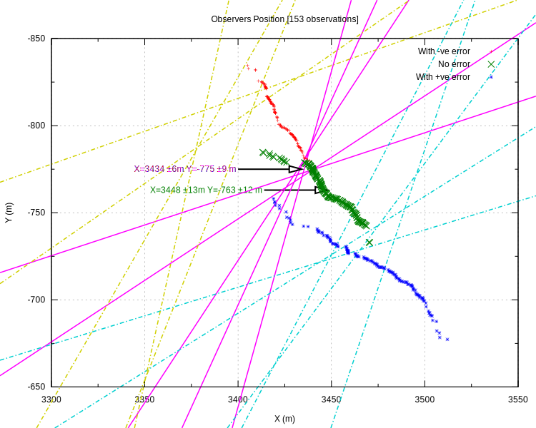
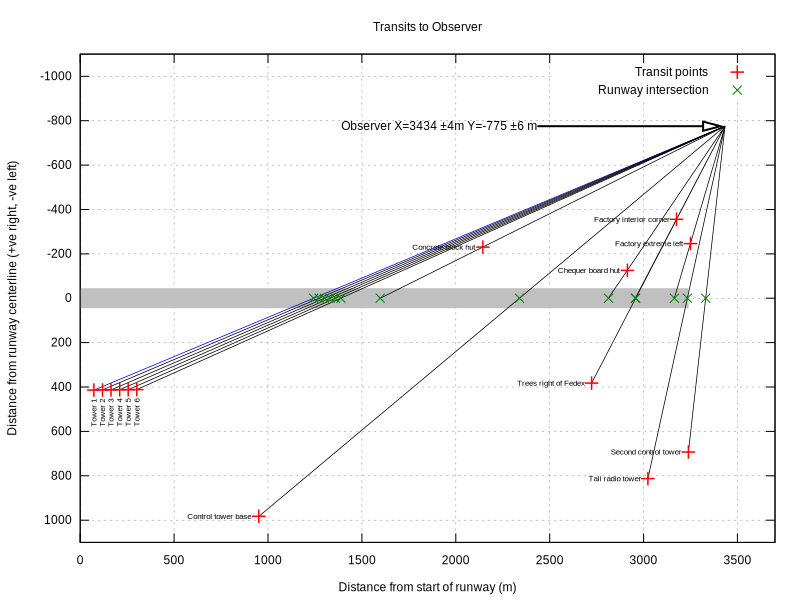
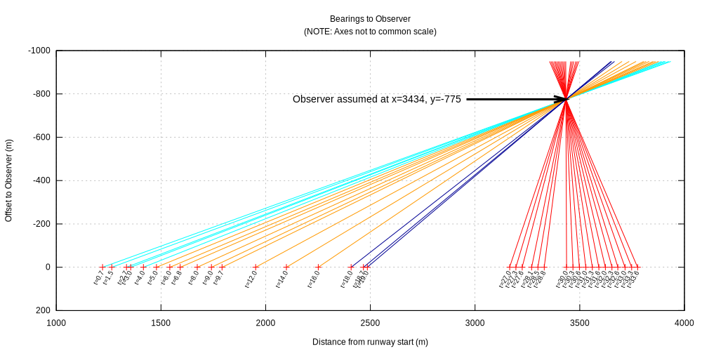

<!-- 
=============================================
Generated file from analysis.readme.py:main()
=============================================
-->
# Analysis of an A340 Takeoff Video

I came across a video of an A340 taking off where the aircraft becomes airborne only just
before before the end of the runway.
You can see the video here, it starts part way through the takeoff:

It looked an unusual takeoff to me and I was curious about what objective information such as
speed and distance data, and to what accuracy, could be extracted from the video by looking at
individual frames.
It seemed like it would be fun to investigate this as I had never done anything like this before.

# Summary

I found that:

* The takeoff started 34.2 ±1.4 seconds before the beginning of the video with the aircraft 75 ±159m from the
start of the runway.
* At the start of the video the ground speed is 113 ±5 knots. The aircraft is 1110 ±25m from the
start of the runway with 2130 ±25m of runway remaining.
* When the nose wheel comes off the ground speed is 159 ±5 knots with 865 ±25m of runway remaining.
* The rotation rate at this point is +1.4 degrees/second for the next 5 seconds to +7 degrees.
* When the main wheels come off the ground speed is 176 ±5 knots with 198 ±25m of runway
remaining.
* The takeoff roll took 59.8 ±1.4 seconds.
* The aircraft crosses the end of the runway 2.2 seconds later at a ground speed of 180 ±5 knots.
* At 29 seconds there is a further pitch increase of +1.4 degrees/second from +7 to +12 degrees.
* The useful part of the video ends at t=35.7 seconds, the ground speed is 193 ±5 knots and the aircraft is 755
±25m beyond the end of the runway 15.
* The observer is within 25 metres of Latitude -23.011945, Longitude -47.115872

Here is the data plotted on an image of Viracopos International Airport from Open Street Map.
The red boxes illustrate the accuracy of the position estimate.
The probable location of the observer is also shown, the black lines are transits that establish that position.
The annotations in blue contain:

* v= The ground speed in knots.
* t= The time as video time, followed by [...], the estimated time from start of takeoff.
* d= The distance from the start of the runway, followed by [... to go], the distance to the end of the runway.

# Data

Apart from the video itself there were the following sources of information that were useful:

The airport was identified as [Viracopos International Airport](https://en.wikipedia.org/wiki/Viracopos_International_Airport)
ICAO code SBKP in South America.

The aircraft was identified [on youtube](https://www.youtube.com/watch?v=XbWaXdA5jY0&feature=youtu.be) as
an A340-300 registration [9H-BIG](https://www.planespotters.net/airframe/Airbus/A340/9H-BIG-AIR-X-Charter/RJgIaj)
operated by Air-X.
It was taking off from runway 15.
I used Wikipedia to get some [drawings of the A340-300](https://en.wikipedia.org/wiki/Airbus_A340).

Additional sources of data were from[Open Street Map](https://www.openstreetmap.org/) and
[Google Maps, Street View and Earth](https://www.google.com/).
The latter has fairly high resolution, low level, aerial photography of the area but the images are
quite oblique.
There may be the following errors in determining the Latitude and Longitude of observed positions from Google Maps:

* Positioning errors of the aircraft that took the image.
* Alignment errors when assembling a mosaic of photographs.
* Position errors in oblique photographs due to the correction (or lack thereof) for terrain.

None of these are reasonably quantifiable in this investigation.
No contradictory errors were found in comparing positions so a fairly arbitrary, but conservative,
position error of ±25 (m) is assumed for positions from aerial imagery.

## Unknowns

I don't know:

* Anything about A340 operations, performance, reference speeds, limits, screen heights etc.
* The date and time of this video.
* The metrological conditions.
* The terrain, especially runway slope.
* Any movement of the observer, I have assumed that the observer is stationary and
there is strong evidence for this.
* Any details of the video camera or operator.
* Any editing of the video that alters its fidelity (i.e the video is taken in good faith).

If any of these assumptions are wrong it will affect this analysis greatly. Any errors are entirely mine.

## Measurements

Several measurements seemed practical and useful:

* Transits: the aircraft transits multiple fixed objects such as lighting towers, lampposts and so on.
These give valuable information such as:
    * When the aircraft passes a fixed object its ground speed can be measured by noting the time when the
    nose and tail pass the object.
    The length of the aircraft divided by the elapsed transit time gives the ground speed.
    * Of particular value are transits where two objects are seen lined up with each other.
    If these objects can be found on a map or aerial photograph this gives a line of position to the observer.
    * If the location of the fixed object and the observer are known then the position of the aircraft on the
    runway as it passes through the transit line can be calculated to a fairly high precision.
* Aspect: this is the relative bearing of the observer from the axis of the aircraft in any frame.
This can give an estimate the observer's position or, conversely, given the observer's position,
can estimate the aircraft yaw
The aspect can be measured by either:
    * Observing when parts of the aircraft line up (for example the nose with number 3 engine).
    * Measuring the apparent span and apparent length of the aircraft and so calculate the aspect given the
    true span and length of the aircraft.
* Pitch: The pitch of the aircraft was measured by comparing the line of cabin windows relative to the
video frame.
This is not a very reliable measurement as it is vulnerable to camera roll, which is unknown.
Still, some conclusions can be drawn.

An estimate of the error was made for each of these measurement which was used to estimate the accuracy of each conclusion.

## Terminology

* 'Time' is video time in seconds or minutes:seconds:frames (mm:ss:ff).
* 'Distance' is in metres from either the start of the video or the start of the runway (as specified).
* 'X axis' is along runway 15 with x=0 at the threshold of runway 15. Values in metres.
* 'Y axis' is at right angles to runway 15 +ve to the right, -ve to the left. Values in metres.

# Analysis

## Ground Speed

52 transits of the aircraft passing fixed objects were measured during the video and the ground speed and
likely error were calculated.
The left graph shows the ground speed in knots, the ground speed error averages out to be ±10 knots.
The right graph shows those values extrapolated back towards the start of the takeoff:

This is a large extrapolation, with its consequent dangers, but the data seems reasonable.
This extrapolation gives a start of takeoff (video) time of -32.8 ±2.8 seconds.

## Distance Down The Runway

This can be estimated by integrating the ground speed data.
The distance errors are the speed errors multiplied by time.
This left graph shows the distance traveled for mid estimate of ground speed and those values ±10 knots.
The left graph is focused around t=0 and distance from the start of the video.
In the right graph the curves are shifted so that they intersect at t=27.8s which is the time the aircraft
passes the end of the runway (x=3240m).
The right graph shows video time on the x axis plotted against the estimated distance from the runway start.

The right graph suggests the estimated starting positions of the aircraft's takeoff as:

| Calculation | Video Time t (s) | Distance from start of Runway (m) | Distance from start of Runway at t=0 (m) |
| --- | --- | --- | --- |
| Mid speed -10 knots | -30.1 | 537 | 1325 |
| Mid speed | -32.8 | 232 | 1182 |
| Mid speed +10 knots | -35.6 | -87 | 1039 |
| **Range and worst error** | **-32.8 ±2.8** | **232 ±319** | **1182 ±143** |

Table 1: Distance Estimates for the Start of Take off

The mid position looks entirely plausible as from OpenStreetMap there are two entry points to runway 15:

* Taxiway D which is at the runway start.
* Taxiway H which is about 200m from runway start.

Either could have been used, the accuracy of distance calculation is too poor to say which at the moment.
However further confidence and accuracy can be gained in this ground speed / distance calculation once
the calculation of observer position is done and combined with the transit data.

## Position of the Observer

There are several independent ways to identify the observer position:

* Finding two identifiable points in a video frame that are inline.
They are especially valuable as they are independent of most measurement errors apart from location errors.
Here these are called 'full transits'.
* Observing the relative bearing, or *aspect*, of the aircraft assuming that it is moving with a constant heading.
Knowing the position of the aircraft a bearing to the observer can be made.
* Near direct observation by comparing foreground objects with, say, Google StreetView images.

### Full Transits

Five transits are observable, the x/y coordinates are relative to the runway start, +y to the right of runway 15, -y to the left:

| Video Time (mm:ss:ff) | First Point | First Point Lat, Long | First Point X, Y (m) | Second Point | Second Point Lat, Long | Second Point X, Y (m) |
| ---: | --- | ---: | ---: | --- | ---: | ---: |
| 00:02:12 | Tower 1 | -23.001859, -47.148885 | 73, 414 | Fence Break 1 | -23.008422, -47.127443 | 2256, -357 |
| 00:17:22 | Control tower base | -23.010773, -47.145509 | 951, 983 | Embankment inside corner | -23.011606, -47.124922 | 2677, -236 |
| 00:24:26 | Trees right of Fedex | -23.016282, -47.128253 | 2724, 382 | Factory interior corner | -23.013509, -47.120363 | 3175, -356 |
| 00:26:17 | Factory cream stripe | -23.017518, -47.126642 | 2938, 389 | ALUGAM-SE Left | -23.012971, -47.117859 | 3342, -560 |
| 00:28:00 | Tall radio tower | -23.021010, -47.128510 | 3023, 813 | Building corner | -23.015572, -47.120916 | 3270, -140 |

Table 2: Full transits to Observer from Google Earth Positions

These transit lines are plotted below with the mean observer's position.
The time and the aircraft's position on the runway is shown in green:

Combining these gives 10 intersections (any two out of five).
The average of these intesections does not take into account the uncertainty of the positions of
each transit object (actually the *relative position* of each transit object).
So, somewhat conservatively, an accuracy of ±25m is assumed.

As well as establishing the observer, full transits can be used to accurately determine the
aircraft's position on the runway to ±25m:

| Video Time (mm:ss:ff) | Distance from Start of Runway (m) |
| --- | ---: |
| 00:02:12 | 1243 |
| 00:17:22 | 2339 |
| 00:24:26 | 2958 |
| 00:26:17 | 3104 |
| 00:28:00 | 3233 |

Table 3: Aircraft Position from Runway Start from Full Transits

## Aircraft Aspect

As the aircraft passes down the runway it presents a difference *aspect* to the observer and this
can give valuable clues to the observer's relative position (assumed fixed).
The value of this measurement is it contributes to an error estimate for ground speed and can
identify the observer location (assumed fixed) and so provide a check on the ground speed/distance calculation.

The aspect can be measured in two ways:

* When parts of the aircraft line up with each other, for example the nose and the centre of engine number three.
11 measurements of aspect were made and the [Wikipedia plan drawing](https://en.wikipedia.org/wiki/Airbus_A340)
of the A340-300 was used to estimate the bearing of the observer from the fore and aft axis.
The error in aspect/bearing is assumed to be ±3 degrees.
* By comparing the relative size of the apparent span and apparent length.

Initially the assumption is that the aircraft has a constant heading with no yaw.
However if the observer's position is known then any yaw can be calculated, perhaps to compensate for a crosswind.

This graph is of bearings with the estimated errors and best fit of the data assuming that the aircraft is
1182m from the start of the runway at t=0:

The bearings calculated from measurements of the aricraft span and length are regarded as more accurate due to the
larger baseline of the measurements and will be used henceforth.

The bearings to the observer are plotted here:

* Cyan bearings are very fine and will be omitted in the calculation of observer's position.
* Blue bearings are when the nose wheel is off the ground.
* Red bearings are when the aircraft is fully airborne.

The bearings are filtered:

* The Cyan bearings are ignored as the angle is too small to be accurate.
* Pairs of bearings are ignored unless the baseline between them is >1250m

Selecting all the combinations of remaining bearing pairs gives a large number of observer positions.

In the graph below X is distance from start of the runway, Y is the distance to the right (+ve) or left (-ve) of the
aircraft axis. The lines show the full transit lines (a line through two known points):

* Lines in magenta: based on measured transit points.
* Lines in chain dotted yellow: with the measured points moved in opposition by +25m at right angles to the
transit. . The absence of a clear intersection suggests that this offset is unlikely.
* Lines in chain dotted cyan: with the measured points moved in opposition by -25m at right angles to the
transit. Again, the absence of a clear intersection suggests that this offset is unlikely.

Also shown as points are the location of the observer calculated from combinations of the aspect data:
 
* Best estimate points are in green.
* Measurements with worst negative error are in red
* Points with the worst positive error are in blue.

These two position estimates, with independent measurements, are just 18m apart.
Since full transits are regarded as more accurate the observer's position from them of x=3434 y=-775
±25m is used for the rest of this report.

**Conclusion:** The observer is at x=3434 y=-775 ±25m

## Observer's Position From Google StreetView

The calculation shows the observer is at x=3434 y=-775 relative to the start of runway 15 which is
latitude=-23.011945 longitude=-47.115872
[shown here on google earth](https://www.google.com/maps/@-23.011945,-47.115872,55m/data=!3m1!1e3).
Here is a Google StreetView image of that area facing towards the extended centreline, the observer was
on the left about 20m away.

Features that match are:

* The tower in the far distance on the right which appears in the video at t=29.
* The flyover mid right in the far distance.
* The power cables on the left that are seen at t=32 where they are extremely foreshortened as they
are in line with the camera.

(Copyright Google)

The observer is to the left of the picture and somewhat elevated to be able to see the runway.

## Combining Transit and Bearing Data to Improve the Distance Calculation

Given a fixed observer's position the transit information of position and time can be used to calculate
the aircraft's position on the runway when it passes through the transit line.
Here are the transit lines with the aircraft's position on the runway in green.

Here is the position of the aircraft relative to the mid estimate distance calculation performed earlier when
integrating the ground speed. The graph also shows ±25m tolerance lines in red.

The transit points fit well with the mid ground speed estimate +5 knots and the ground speed accuracy can
be improved from ±10 knots to ±5 knots.
The distance estimate is now within ±25m throughout the video.

**Conclusion:** The best estimate of the aircraft ground speed is the mid ground speed estimate with 5 knots added. The speed error is ±5 knots.
The distance error for t>=0 is ±25m.

## Acceleration

This can be calculated by taking the derivative of the ground speed.
Given constant thrust the acceleration would be expected to decline in several stages:

* As parasitic drag increases: 0 <= t < 18
* Additionally it falls further as induced drag is added as the nose wheel comes off: 18 <= t < 25.5
* Additionally it falls even further as the aircraft starts to climb: 25.5 <= t < 33.7

None of these specific events are visible in the analysis, likely due to smoothing of the ground speed data
but the calculated acceleration shows the expected (general) decline.

### Errors in acceleration

The acceleration from our ground speed model is identical whether a -10 or +10 knot error is assumed.
However an error estimate can be made by looking at the time and distance error estimates.

| Speed Error | Time from start take off to end asphalt (s) | Speed (knots) | Mean Acceleration (knots/s) | Error (knots/s) | Distance from start take off from start of runway (m) |
| --- | ---: | ---: | ---: | ---: | ---: | ---: |
| -10 knots | 57.9 | 165 | 2.85 | -0.03 | 537 |
| 0 knots | 60.6 | 175 | 2.88 | 0.00 | 232 |
| 10 knots | 63.4 | 185 | 2.91 | 0.03 | -87 |

Table 4: Acceleration error.

The extreme worst case is when the time estimate and speed estimate are reversed:

| Speed Error | Time from start take off to end asphalt (s) | Speed (knots) | Mean Acceleration (knots/s) | Error (knots/s) | Distance from start take off from start of runway (m) |
| --- | ---: | ---: | ---: | ---: | ---: | ---: |
| -10 knots | 63.4 | 165 | 2.60 | -0.28 | 555 |
| 0 knots | 60.6 | 175 | 2.88 | 0.00 | 515 |
| 10 knots | 57.9 | 185 | 3.19 | 0.31 | 491 |

Table 5: Acceleration error, worst case.

The starting position of 491 to 555m down the runway is extremely unlikely so it is rejected.
However it does help set the likely accuracy of the acceleration calculation.
This is now taken as midway between the two cases so (0.03 + 0.31) / 2.0 which is ±0.17 knots/second.

**Conclusion:** The acceleration is as calculated from the mid values with an error of ±0.17 knots/second.

## Aircraft Yaw

Assuming the observer's position is known the bearings can be re-plotted to calculate the yaw of the aircraft.
The bearings now look like this:

And the calculated yaw is the adjustment made to the bearing data to make it coincide with the observer's position.
The errors are calculated as the sum of the error in the observer's position plus the error in establishing
the bearing of the observer from the aircraft:

The error term vastly exceeds the calculated data but, even so, there seems an interesting, but tentative,
story in the estimated values.
At t=30 the aircraft yaws from -0.5 degrees at a rate of about 0.6 degree/second to the left reaching
-1.9 degrees at the end of the video, a difference of -1.4 degrees.
This might be a correction to a mild crosswind, if so then given the ground speed at that time a yaw of
-1.4 degrees corresponds to a crosswind component of around 4 knots from the left.

This conclusion must be very tentative because the error terms vastly exceed the observed trend.

## Aircraft Pitch

Pitch is regarded as the least reliable measurement as it is directly affected by camera roll angle
which is not known.

The graph below shows the estimated pitch. At t=17.9 rotation starts at 1.4 degrees/second until a
pitch angle of +8 degrees (relative to the nose wheel on the runway).
A further increase to +12 degrees relative is observed at t=29 to 31.

# Conclusions

## Equations of Motion

The best estimate of ground speed, acceleration and distance are given by these equations where t is
the time from the start of the video in seconds and distance is from the start of the runway.

| Measure | Units | Formulae | Tolerance | Notes |
| --- | --- | --- | --- | --- |
| Ground speed | m/s | 5.83e+01 +1.48e+00 * t -7.94e-03 * t^2 -4.18e-05 * t^3 | ±2.5 | See note 1 below. |
| Acceleration | m/s^2 | 1.48e+00 -1.59e-02 * t -1.25e-04 * t^2 | ±0.17 | See note 2 below. |
| Distance | m | 1.11e+03 + 5.83e+01 * t +7.41e-01 * t^2 -2.65e-03 * t^3 -1.04e-05 * t^4 | ±25 for t>=0 | See note 3 below. |

Table 6: Equations of Motion

### Notes

1. The ground speed is the primary formulae.
2. Acceleration is by differentiation of the ground speed.
3. Distance is by integration of ground speed with the offset at t=0 of calculated from the full
transits. The value is the distance from the start of the runway at t=0.
4. The equations are given to three significant figures.
5. The equations are valid from 0 <= t <= 35.7.
6. The equations can be used to extrapolate to t=-34.2, the estimated time that the ground speed is zero i.e. the start
of the takeoff.

## Table of Events

These events are calculated by using the ground speed data corrected by transits by +5 knots (the formulae given above).
The distance tolerance is ±25m for the duration of the video.

| Event | Video Time (s) | Time from Start Take Off (s) | Ground Speed (knots) | Acceleration (knots/s) | From Start of Runway (m) | To end Asphalt (m) | Notes |
| --- | ---: | ---: | ---: | ---: | ---: | ---: | --- |
| Start of take off | -34.2 ±1.4 | 0.0 ±1.4 | -0 | 3.7 ±0.17 | 75 ±159 | 3165 ±159 | Estimated |
| Video starts | 0.0 | 34.2 ±1.4 | 113 ±5 | 2.9 ±0.17 | 1110 ±25 | 2130 ±25 |  |
| Nose wheel off | 17.9 | 52.1 ±1.4 | 159 ±5 | 2.2 ±0.17 | 2375 ±25 | 865 ±25 | Rotation of ~1.4 °/s to t=23 |
| Main wheels off | 25.6 | 59.8 ±1.4 | 176 ±5 | 1.9 ±0.17 | 3042 ±25 | 198 ±25 |  |
| End asphalt | 27.8 | 62.0 ±1.4 | 180 ±5 | 1.8 ±0.17 | 3240 ±25 | 0 ±25 | Defined datum |
| Video ends | 35.7 | 69.9 ±1.4 | 193 ±5 | 1.5 ±0.17 | 3995 ±25 | -755 ±25 |  |

Table 7: Selected Events

# Resources

## Software

* [`Python`](https://www.python.org/) for general computation.
* [`ffmpeg`](https://ffmpeg.org) video extraction software.
* [Graphic Converter](https://www.lemkesoft.de/en/products/graphicconverter/) - Pixel perfect frame measurement.
* [`gnuplot`](http://www.gnuplot.info/) for plotting.

