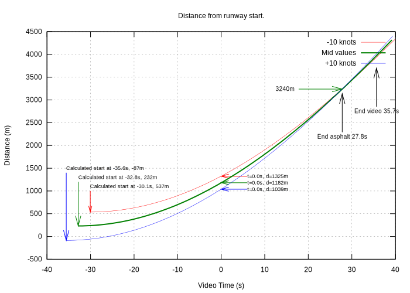
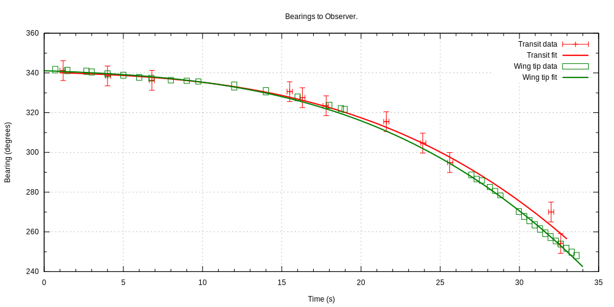

# Technical Analysis of an A340 Takeoff Video

I came across a video of an A340 taking off from Viracopos International Airport in South America where the aircraft only just gets airborne before the end of the runway. You can see the video here, it starts part way through the take off:

I was curious about what objective information such as speed and distance data could be extracted from the video by looking at individual frames.

# Data

The aircraft was identified [on youtube](https://www.youtube.com/watch?v=XbWaXdA5jY0&feature=youtu.be) as an A340-300 registration [9H-BIG](https://www.planespotters.net/airframe/Airbus/A340/9H-BIG-AIR-X-Charter/RJgIaj) operated by Air-X. I used Wikipedia to get some [drawings of the A340-300](https://en.wikipedia.org/wiki/Airbus_A340).

## Unknowns

I don't know the following:

* Anything about A340 operations, reference speeds, field limits etc.
* The date and time of this video.
* The metrological conditions existed at the take off time.
* The terrain, especially runway slope.
* The movement of the observer (I have assumed that the observer is stationary).
* Any details of the video camera or operator.
* Any editing of the video that alters its fidelity (so the video is taken in good faith).

If any of these assumptions are wrong it will affect this analysis greatly.

## Measurements

Three measurements seemed practical and useful:

* Ground speed; the aircraft transits multiple fixed objects such as lampposts, lighting towers and so on. Taking transit points such as the aircraft nose and tail cone and knowing the length of the fuselage gives the ground speed.
* Aspect; this is the relative bearing of the observer from the axis of the aircraft. The measurement is made by observing when parts of the aircraft line up (for example the nose with number 3 engine).
* Pitch; The pitch of the aircraft was measured by comparing the line of cabin windows relative to the video frame. This is not a very reliable measurement as it is vulnerable to camera roll, which is unknown. Still, some conclusions can be drawn.

An estimate of the error was made for each measurement.

# Analysis

## Ground Speed

52 transits of fixed objects were measured during the video and the ground speed and likely error were calculated. The error is twofold:

* Error in assessing the time of the event, this is assumed to be ±5 frames or ±1/6 of a second.
* Transit error, this is assumed to be ±1 frame (±1/30 second). However the error calculation is exaggerated by the aspect of the aircraft so when the observer is at right angles to the path of flight it is at a minimum but increases as the observer approaches the for and aft aircraft axis (where the error would be infinite). See 'Aspect' below.

Here are the calculated ground speed in knots with the errors and a best fit to the mid value:

For the rest of this analysis the ground speed is the fit to mid value ±10 knots.

### Extrapolating Before the Video Starts

The best fit curve can be extrapolated back to the start of the take off:

This is a large extrapolation, with its consequent dangers, but the data seems reasonable. This extrapolation gives a start of take off (video) time of -33 ±3 seconds.

## Acceleration

This can be calculated by taking the derivative of the ground speed, the ±10 knot speed error does not affect the acceleration calculation.

Given constant thrust the acceleration would be expected to decline in several stages:

* As parasitic drag increases: 0 <= t < 18
* Additionally it falls further as induced drag increases as the nose wheel comes off: 18 <= t < 25.5
* Additionally it falls even further as the aircraft starts to climb: 25.5 <= t < 33.7

None of these specific events are visible in the analysis, likely due to smoothing of the ground speed data but the calculated acceleration shows the expected (general) decline.

## Distance

Distance from video start can be estimated by integrating the ground speed data. This calculation will be affected by errors in ground speed estimation proportional to the speed error multiplied by time.

This graph shows the distance traveled for:

* Ground speed from mid values -10 knots.
* Ground speed from mid values.
* Ground speed from mid values +10 knots.

### Calculating the Location of the Start of Take Off

Since it is observed that the aircraft crosses the and of asphalt at t=27.8, d=3240m seconds we can work back from that for each scenario and calculate the position from the start of the runway. This is equivalent to adjusting the distance curves such that they all cross a t=27.8s, d=3240m. This shows the estimate of the start of the take off.

| Calculation | Start time (s, video time) | Distance from start of Runway (m) |
| --- | --- | --- |
| Mid speed -10 knots | -30.1 | 529 |
| Mid speed | -32.8 | 232 |
| Mid speed +10 knots | -35.5 | -77 |
| **Range, worst error case** | **-33 ± 3** | **232 ± 310**  |

[Some rounding differences may be present.]

The mid position looks entirely plausible as from OpenStreetMap there are two entry points to runway 15:

* Taxiway D which is at the runway start.
* Taxiway H which is about 200m from runway start.

Either could have been used, the accuracy of distance calculation is too poor to say which.

Further confidence can be gained in this ground speed / distance calculation by looking at the calculation of observer position, of which more later.

## Pitch

Pitch is the least reliable measurement from the video as it is directly affected by camera roll angle of which we know nothing.

The graph below shows the estimated pitch. At t=18 rotation starts at 1.4 degrees/second until a pitch angle of +8 degrees (relative to the nose wheel on the runway). A further increase to +12 degrees relative is observed at t=29 to 31.

## Bearings to the Observer

As the aircraft passes down the runway it presents a difference *aspect* to the observer and this can give valuable clues to the observers relative position (assumed fixed). The aspect can be measured by seeing when parts of the aircraft line up with each other, for example the nose and the centre of engine number three.

The value of this measurement is it contributes to an error estimate for ground speed and can identify the observer location (assumed fixed) and so provide a check on the ground speed/distance calculation.

11 measurements of aspect were made and the [Wikipedia plan drawing](https://en.wikipedia.org/wiki/Airbus_A340) of the A340-300 was used to estimate the bearing of the observer from the fore and aft axis. The error in aspect/bearing is assumed to be ±3 degrees.

Here is a graph of those bearings with the estimated errors and best fit of the data:

### Combining Bearings and Distance Data

Using the best fit of the bearing and the distance estimate the bearings can be plotted:

These bearings are filtered:

* The first three bearings (shown in orange above) are ignored as the angle is too small for accurate estimation.
* Pairs of bearings are ignored unless the baseline between them is > 500m

Selecting all the combinations of remaining bearing pairs gives the following 17 observer positions. X is distance from start of video, Y is the distance to the left or right of the aircraft axis +ve right and -ve left.

The observers position is (2250, -750) ±50m. 

Here is a Google StreetView image of that area facing towards the extended centreline. Features that match are:

* The tower in the far distance on the right which appears in the video at t=29.
* The flyover mid right in the far distance.
* The power cables on the left that are seen at t=32 where they are extremely foreshortened as they are in line with the camera.

The observer is to the left of this Google StreetView image and at an elevation about half way up the power poles to be able to see the runway.

# Conclusions

## Table of Events

| Event | Video Time (s) | Time from Start Take Off (s) | Ground Speed (knots) | Acceleration (knots/s) | From Start of Runway (m) | To end Asphalt (m) | Notes |
| --- | ---: | ---: | ---: | ---: | ---: | ---: | --- |
| Start of take off | -32.8 ± 2.8 | 0.0 ± 2.8 | 0 | 3.6 | 232 ± 312 | 3008 ± 312 | Estimated |
| Video starts | 0.0 | 32.8 | 108 ± 10 | 2.9 | 1182 ± 143 | 2058 ± 143 |  |
| Nose wheel off | 17.9 | 50.7 | 154 ± 10 | 2.2 | 2400 ± 51 | 840 ± 51 | Rotation of ~1.4 °/s to t=23 |
| Main wheels off | 25.6 | 58.5 | 171 ± 10 | 1.9 | 3048 ± 11 | 192 ± 11 |  |
| End asphalt | 27.8 | 60.6 | 175 ± 10 | 1.8 | 3240 ± 0 | 0 ± 0 | Defined datum |
| Video ends | 33.7 | 66.5 | 185 ± 10 | 1.6 | 3783 ± 30 | -543 ± 30 |  |

## Mapping

Here is the data plotted on an image of [Viracopos International Airport](https://www.openstreetmap.org/?mlat=-23.006944&mlon=-47.134444&zoom=14#map=15/-23.0116/-47.1248) from Open Street Map. The estimated ground speed (knots) for each event is shown with the t=video time followed by the estimated time since start of take off in square brackets. The red boxes illustrate the accuracy of the position estimate.

The probable location of the observer is also shown.

The annotations in blue contain:

* v= The ground speed in knots.
* t= The time as video time in seconds.
* [...] The time as estimated time from start of take off in seconds.

# Resources

## Software

* [`ffmpeg`](https://ffmpeg.org)video extraction software.
* [Graphic Converter](https://www.lemkesoft.de/en/products/graphicconverter/) - Pixel perfect frame measurement.

