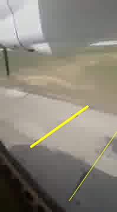
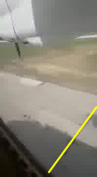

# AN-24 Accident at Nizhneangarsk, Russia

The aircraft approaches at what seems to be a very high speed and then veers off the runway to the right.

## Resources

Apart from the video, Wikipedia on the flight [Angara Airlines Flight 200](https://en.wikipedia.org/wiki/Angara_Airlines_Flight_200) and on [Nizhneangarsk Airport](https://en.wikipedia.org/wiki/Nizhneangarsk_Airport)

Other sources of information:

* [AV Hearald](http://avherald.com/h?article=4c9b1ac2&opt=0)
* [Aviation Safety Network](https://aviation-safety.net/database/record.php?id=20190627-0)
* [RT videos](https://www.rt.com/news/462775-russia-nizhneangarsk-crash-landing/)
* [Hi resolution imagery of the approach path](https://www.google.com/maps/@55.8088004,109.6072157,835m/data=!3m1!1e3)

# Landmarks in the Video

The video shows some distinct landmarks, particularly colourful buildings.
These can be identified on aerial imagery to give the aircraft position on the extended centreline of runway 22 (the aircraft appears to make a straight in approach with little lateral deviation).
The error in this method is estimated to be ±100m when 2500m from the runway, reducing to ±10m at the runway edge.

Here are a couple of examples, frame 1 (t=0s) where the edge of a settlement and a dark smudge on a sandy part of an island line up.
The magenta line shows the estimated line the aircraft is flying across:

&nbsp;

Here are those features on the aerial imagery, the extended centreline of runway 22 is in red:

This puts the aircraft about 2490 ±100m from the threshold of runway 22.

And here is frame 483 (t=16.0s) where a two distinctive buildings can be seen lined up:

&nbsp;

Those buildings on the aerial imagery:

This puts the aircraft about 1041 ±49m from the threshold of runway 22.

Whilst this technique is useful it requires identifiable ground features and few exist after the aircraft crosses the threshold, and none 330m beyond the threshold.

Fortunately another technique exists due to the particular construction of this runway which is typical of Siberian airports. Even better, the two (independent) techniques overlap for about four seconds of video time so they can be cross checked.

# Counting Slabs

The runway at Nizhneangarsk is made of concrete slabs that are ubiquitous in Siberia for roads and airfields. This gives the runway a particular pattern where dark vegetation has grown up at the edges which contrasts with the pale concrete of the slab.
These edges can be clearly seen, and mesured, on the video and high-resolution aerial imagery.
The size of these slabs can then be used to calculate the speed of aircraft as it passes over the boundaries.

## Standard Slabs

Standardised slabs used for roads and runways in Siberia measure 6m x 1.8m x 0.2m (likely thicker on runways) [the numbers from the author's engineering file].
For confirmation here is an enhanced aerial image where the south side of the runway has been annotated, rather crudely, with yellow lines at the edge of each slab (the slabs are laid with their long side in the runway direction).

Careful measurement of the imagery confirms these 10 slabs are 98 pixels long which, at 0.617 m/pixel for the image, gives a slab length of 6.05m.
The value of 6m is used hereon.

## Speed by Slab Transits

As an example of the principle, here are two frames, frame 841 and 843, they are 1/15 second apart (at 30 fps).
The slab edges are quite distinct in the original frames and are marked here as yellow lines, the broad line on the left image is the same part of the runway as the line on the right image.
The light patch on the right of the concrete, and the lightish patch in the grass that confirms the sequence of frames.

The near match of the right hand line in the left frame with the line in the second frame means that the aircraft has traveled almost exactly 6m in that 1/15th of a second.
This gives a ground speed of 90 m/s (175 knots).

&nbsp;

# Analysis

There are two sets of measurements calculated independently from each other:

* Comparing the video to aerial imagery which gives the aircraft position over time. This can be differentiated for aircraft ground speed.
* Counting concrete slab transits that can give the aircraft ground speed over time. This can be integrated for aircraft position and differentiated for the longitudinal acceleration of the aircraft.

## Distance

TODO

&nbsp;

TODO

&nbsp;

&nbsp;

&nbsp;

## Boundry Fence Impact

The sequence below shows four consecutive frames from the video of the starboard undecarrige collapse as the aircraft goes through an obstruction, the airfield fence. 

&nbsp;&nbsp;&nbsp;

The first frame [1684] shows the moment before impact, the obstruction is on the left which looks like as substantial concrete block, the dark disc at the bottom is the tyre and the silver vertical is the undercarridge leg. The second frame (t=56.1s)shows the moment of impact and the last two frames show progressive collapse of the starboard landing leg. The last of the four frames is rotated right, most likely due to the acceleration forces on the person filming which would naturally rotate a hand held camera to the left.

### Boundary Fence Impact Speed and Acceleration

It is possible to estimate the speed when the aircraft hits the boundary.

* The last measured position was at t=45.7 s, v=60.0 m/s, d=1435.5 m.
* Video time of the impact is t=56.1 seconds and the distance of the fence from the threshold is 213 m beyond the runway edge at d=1652 + 213 = 1865m.
* The difference in time is 56.1 - 45.7 = 10.4 seconds and in distance is 1865 - 1435.5 = 429.5m
* This implies an average velocity of 429.5 / 10.4 = 41.3 m/s.
* If the object is constantly (de-)accelerating from a starting velocity of 60.0 m/s implies an change in velocity of 2 * (41.3 - 60) = -37.4 m/s.
* This would give a mean acceleration -37.4 / 10.4 = -3.6 m/s^2 which is consistent with the last calculated acceleration of -3.7 m/s.
* This gives an impact velocity of 60.0 - 37.4 = 22.6 m/s (44 knots).

## Final Impact

TODO

# Summary of Events

TODO

| Time (s) [frame] | Distance from runway edge (m) | Ground Speed (m/s, knots) | Acceleration (m/s^2) | Notes |
| --- | ---: | ---: | ---: | ---: | ---: | ---: | --- |
| 0.0 [1] | 0.0 ±1.4 | -0 | 3.7 ±0.17 | Start of take off. |

Table 7: Selected Events

