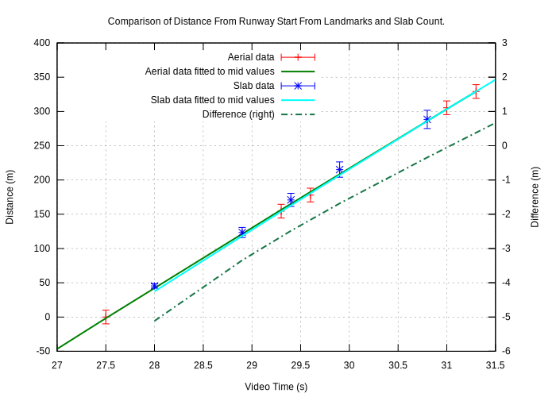

# AN-24 Accident at Nizhneangarsk, Russia

On Thursday 27 June 2019 an AN-24 of Angara Airlines, flight number 2G200, flying from Ulan-Ude Airport was destroyed whilst landing at Nizhneangarsk Airport. Reportedly, the left engine had failed in flight. A video of the landing taken by a passenger sitting on the right hand side under the wing was posted online.

The aircraft approaches at high speed and after touchdown it veers off the runway to the right eventually colliding with a series of obstructions. Here is some analysis of that video to give a picture of the speed, position and acceleration forces experienced by the aircraft.

## Summary of Observations

* At the start of the video the aircraft is on the extended centreline of Nizhneangarsk runway 22 at a distance of 2482±98 m from the start of the runway. Ground speed is 82.8±2.0 m/s, (161±4 knots).
* The ground speed slowly increases to a maximum of 92.7±3.5 m/s (180±7 knots) at around t=17.0 seconds when the aircraft is 964±44 m from runway 22.
* The aircraft crosses the start of runway 22 at t=27.5 travelling at 88.6±2 m/s (172±4 knots).
* Touchdown is at t=33.8 s, 549±14 m (about 1/3rd down the 1653m runway) at 84.3±2 m/s (164±4 knots). Acceleration is -1.1 m/s^2.
* At t=36.0 the aircraft starts drifting to the right, possibly due to a burst tyre. The aircraft is 731±16 m down the runway travelling at 81.8±2 m/s (159±4 knots).
* The aircraft departs the runway at t=46.1 s, 1463±41 m down the runway at 58.7±3.0 m/s (114±6 knots). Acceleration is -3.9 m/s^2.
* At t= 56.1 there is an impact with the boundary fence 1853m from the start of the runway. This collapses the starboard undercarriage. Impact speed is around 19 m/s (37 knots). 
* 36m further on at about t=58.0 the aircraft impacts a building. Speed at this time is probably around 5 to 10 m/s (10 to 19 knots).
* The video ends at t=60.6 seconds.

## Resources

Apart from the video, there is:

* Wikipedia on [Angara Airlines Flight 200](https://en.wikipedia.org/wiki/Angara_Airlines_Flight_200) and on [Nizhneangarsk Airport](https://en.wikipedia.org/wiki/Nizhneangarsk_Airport)
* [AV Hearald](http://avherald.com/h?article=4c9b1ac2&opt=0)
* [Aviation Safety Network](https://aviation-safety.net/database/record.php?id=20190627-0)
* Videos from [RT](https://www.rt.com/news/462775-russia-nizhneangarsk-crash-landing/)
* Hi resolution (~0.6m per pixel) imagery of the area, for example from [google maps](https://www.google.com/maps/@55.8088004,109.6072157,835m/data=!3m1!1e3).

# Methodology

The following techniques are used to calculate the position of the aircraft:

* Matching landmarks in the video with aerial imagery.
* Examining runway details in the video to estimate the aircrafts ground speed.
* Calculating the likely progress of a ballistic body.

Video metadata shows the video was shot at 30 frames per second and this will be confirmed in these calculations.

## Landmarks in the Video

The video shows some distinct landmarks, in particular some colourful and readily identifiable buildings.
These can be seen on aerial imagery and used to find the aircraft position on the extended centreline of runway 22 (the aircraft appears to make a straight in approach with little lateral deviation).

Here are two examples.
Frame 1 (t=0s) shows the line up of the edge of a settlement with a dark smudge on a sandy part of an island.
The magenta line shows the estimated ground line the aircraft is flying across, the red line is the extended centreline of runway 22:

| Camera View | Aerial View |
| :--: | :--: |
|  |  |

This puts the aircraft 2490±98m from the start of runway 22.

The second example is frame 483 (t=16.0s) where a two distinctive buildings are lined up:

| Camera View | Aerial View |
| :--: | :--: |
|  |  |

This puts the aircraft at 1041 ±49m from the start of runway 22.

There are numerous opportunities here but around 15 measurements are sufficient to establish the flight path. This measurement is of distance and this can be differentiated to give velocity. Errors in this method is estimated to be ±100m when 2500m from the runway, reducing to ±10m at the runway edge.

This technique is useful but it requires identifiable ground features and few exist after the aircraft crosses the threshold, and none once 330m beyond the start of runway 22. Fortunately another technique exists due to the particular construction of this runway which is typical of Siberian airports. Even better, these two (independent) techniques overlap for about four seconds so they can be cross checked with each other.

## Counting Slabs

The runway at Nizhneangarsk is made of concrete slabs that are ubiquitous in Siberia for roads and airfields. This gives the runway a particular pattern where vegetation growth or water staining at the slab edges contrasts with the pale concrete of the slab.
These edges can be clearly seen, and measured, on the video and high-resolution aerial imagery.
The aircraft's progress across these slabs can be used to calculate the velocity. This can be integrated for distance or differentiated for acceleration.

### Standard Slabs

Standardised slabs used for roads and runways in Siberia measure 6m x 1.8m (data from the author's engineering file). For confirmation here is an enhanced aerial image of the runway at Nizhneangarsk where the south side of the runway has been annotated, rather crudely, with yellow lines at the edge of each slab (the slabs are laid with their long side in the runway direction).

Measurement of this imagery shows that these 10 slabs are 98 pixels long which, at 0.617 m/pixel for this image, gives a slab length of 6.05m. The value of 6m for slab length is used hereon.

### Speed by Slab Transits

These slab edges can be seen quite clearly on the video. As an example here are two frames [841 and 843] which are 1/15 second apart (at 30 fps).

&nbsp;

For clarity the edges of the slabs are identified with yellow lines:

&nbsp;

The broad line on the left image is the same part of the runway as the line on the right image. So the near match of the right hand line in the left frame with the line in the second frame indicates that the aircraft has traveled almost exactly 6m in that 1/15th second.
This gives a ground speed of 90 m/s (175 knots).

The light patch on the right of the concrete, and the lightish patch in the grass that confirms this sequence.

This is a speed measurement and can be integrated for distance or differentiated for acceleration. The accuracy is estimated as 10% of a slab so if four slabs are counted the error is 2.5%.

# Data From Video B

A second video was posted on YouTube that showed images from a security camera overlooking the airport. The camera is facing roughly west south west:

This video was recorded at 30 f.p.s.

## Camera Position

## Camera Resolution, Heading and Focal Length

## Matching TimeLines

## Observed Events

## Aircraft Position and Speed

## Equation of Motion

## Comparison with Video A

| Video Time A (s) | Event Video A | Video Time B (s) | Event Video B | Difference (s) |
| --: | :--- | ---: | :--- | ---: |
|   35.5 | x=752 m from video B in video A time     |    1.4 | First appearance, x=752 m |   34.1 |
|   36.0 | Start of drift to the right.             |    1.6 | Tyre smoke and dust                     |   34.4 |
|   46.1 | Runway disappears                        |   11.6 | Start of large dust plume               |   34.5 |
|   57.0 | Final impact?                            |   23.0 | Start of smoke plume                    |   34.0 |

# Computed Data

## Position

TODO

&nbsp;

TODO

&nbsp;

## Ground Speed

&nbsp;

&nbsp;

## Acceleration

TODO

&nbsp;

TODO

## Equations of Motion

The data fitting is done with a third order polynomial. The fit of the landmark data to 3 S.F. is:

d(t) = -2.481e+03 + 8.276e+01 * t + 5.914e-01 * t^2 + -1.173e-02 * t^3

This is valid for 0 <= t <= 31.3 seconds.

The fit to the slab data is, to 3 S.F.:

v(t) = 2.843e+02 + -1.645e+01 * t + 4.789e-01 * t^2 + -4.952e-03 * t^3

This is valid for 28.0 <= t <= 45.7 seconds.

## After t=45.7 Seconds

The last compute postion at t=45.7 seconds is:

| Time | Position | Ground Speed | Acceleration |
| :--: | :--: | :--: | :--: |
| 45.7 s | 1442 ±48 m | 60.0 ±3.7 m/s, 117 ±12 knots | -3.7 ±0.3 m/s^2 |

There are no landmarks or visible features after t=45.7 seconds that can be used to give speed or position but there is an event that can be used to estimate this.

### The Boundary Fence Impact

At t=56.1s the aircraft collides with the boundary fence and this fence is readily identifiable on the aerial imagary as being 1853m from the satr of runway 22. The sequence below shows four consecutive frames from the video of the starboard undercarriage collapse as the aircraft goes through the airfield boundary. 

&nbsp;&nbsp;&nbsp;

The first frame [1684] shows the moment before impact, the obstruction is on the left which looks like as substantial concrete block, the dark disc at the bottom is the tyre and the silver vertical is the undercarriage leg. The second frame (t=56.1s) shows the moment of impact and the last two frames show progressive collapse of the starboard landing leg. The last frame is rotated somewhat to right, most likely due to the forces on the person filming which would naturally rotate a hand held camera to the left.

### Boundary Fence Impact Speed and Acceleration

The impact point is 1853m from the start of runway 22 and at 10.4 seconds after the last known position. Given the initial speed and initial position the mean speed can be calculated. Assumming constant deacceleration the impact speed, and acceleration can be calculated.

| Calculation | v initial (m/s) | d initial (m) | a (m/s^2) | v impact (m/s) |
| :--: | :--: | :--: | :--: | :--: |
| Mid point | 60.0 | 1441.5 | -3.9 | 19.1 |
| +ve error | 63.8 | 1489.3 | -5.5 | 6.2 |
| -ve error | 56.3 | 1393.8 | -2.3 | 32.0 |

The mid point data computed acceleration of -3.9 m/s^2 agrees very well with the last observed acceleration of -3.7 ±0.3 m/s^2

## Final Impact

36m beyond the boundary fence is a building that is where the aircraft finally stopped. *Assuming* the acceleration is the same as before the boundary fence impact and *ignoring* any speed reduction caused by the boundary fence impact the final impact speed would be:

| Calculation | v final |
| :--: | :--: |
| Mid point | 9.1 m/s (18 knots) |
| +ve error | No impact |
| -ve error | 29.3 m/s (57 knots) |

Images of the aftermath suggest that the mid-point calculation is probably correct.

# Summary of Events

TODO

| Time (s) | Position (m) | Ground Speed (knots) | Acceleration (m/s^2 ) | Description |
| ---: | ---: | ---: | ---: | :--- |
| 0.0 | -2482 ±98 | 161 ±4 | N/A | Start of video. |
| 17.0 | -964 ± 44 | 180 ±7 | 0 |  Maximum ground speed. |
| 27.0 | 0 ±10 | 172 ±4 | N/A | Start of runway 22. |
| 33.8 | 572 ±15 | 163 ±2 | -1.1 | Touchdown. |
| 45.6 | 1438 ±40 | 116 ±10 | -3.7 ±0.3 | Last calculated speed and 	position. |
| TODO | est. TODO | est. TODO | est. TODO | Departure from runway. |
| TODO | est. TODO | est. TODO | est. TODO | Impact with airfield perimeter, undercarriage collapses. |
| est. TODO | est. TODO | est. TODO | est. TODO | Final impact. |

Table 7: Selected Events

