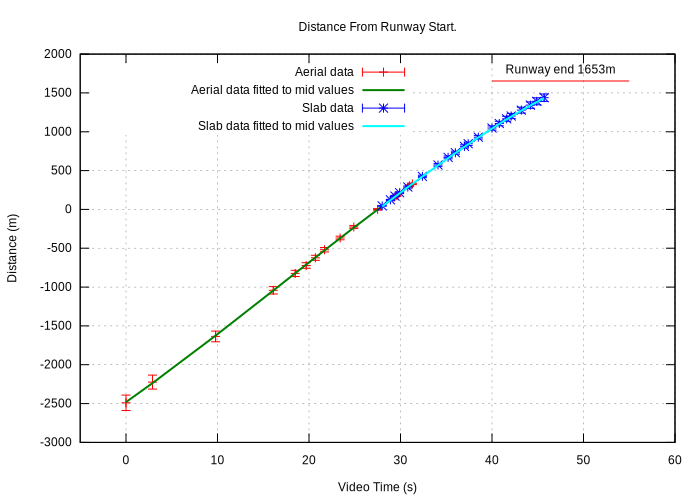
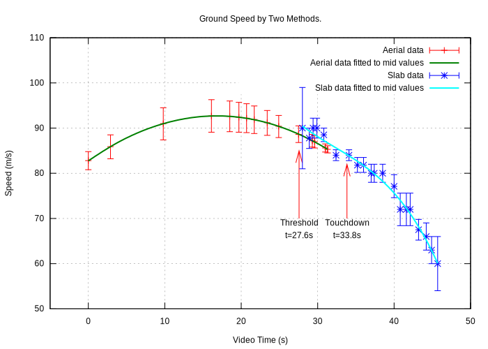
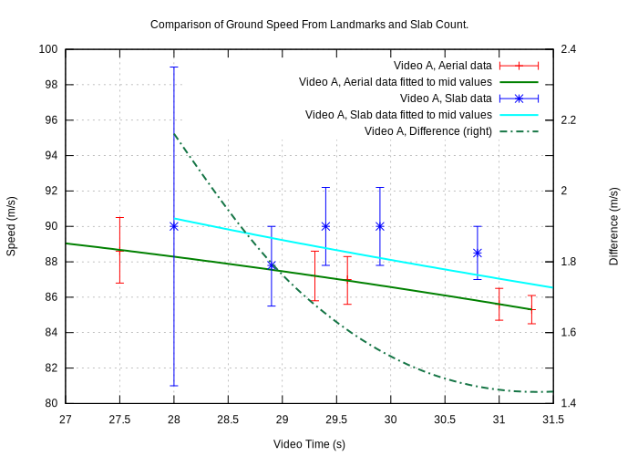
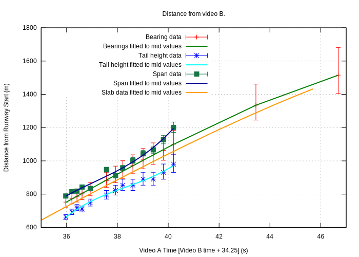
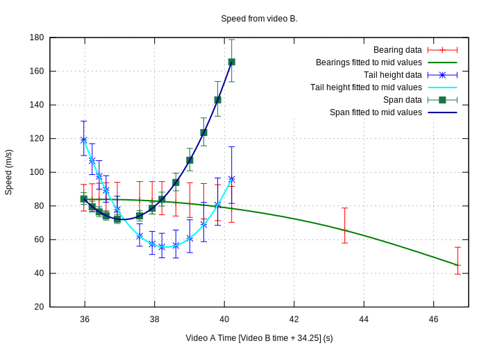

# AN-24 Accident at Nizhneangarsk, Russia

On Thursday 27 June 2019 an AN-24 of Angara Airlines, flight number 2G200, flying from Ulan-Ude Airport was destroyed whilst landing at Nizhneangarsk Airport. Reportedly, the left engine had failed in flight. A video of the landing (video 'A') was taken by a passenger sitting on the right hand side under the wing was posted online.

The aircraft approaches at high speed and after touchdown it veers off the runway to the right eventually colliding with a series of obstructions. Here is some analysis of that video to give a picture of the speed, position and acceleration forces experienced by the aircraft.

A second video (video 'B') emerged that was taken from a fixed security camera overlooking the airfield. This was also used in the analysis but played a minor role other than confirming the events of video 'A'. 

## Summary of Observations

* At the start of the video the aircraft is on the extended centreline of Nizhneangarsk runway 22 at a distance of 2482±98 m from the start of the runway. Ground speed is 82.8±2.0 m/s, (161±4 knots).
* The ground speed slowly increases to a maximum of 92.7±3.5 m/s (180±7 knots) at around t=17.0 seconds when the aircraft is 964±44 m from runway 22.
* The aircraft crosses the start of runway 22 at t=27.5 travelling at 88.6±2 m/s (172±4 knots).
* Touchdown is at t=33.8 s, 549±14 m (about 1/3rd down the 1653m runway) at 84.3±2 m/s (164±4 knots). Acceleration is -1.1 m/s^2.
* At t=36.0 the aircraft starts drifting to the right, possibly due to a burst tyre. The aircraft is 731±16 m down the runway travelling at 81.8±2 m/s (159±4 knots).
* The aircraft departs the runway at t=46.1 s, 1463±41 m down the runway at 58.7±3.0 m/s (114±6 knots). Acceleration is -3.9 m/s^2.
* At t= 56.1 there is an impact with the boundary fence 1853m from the start of the runway. This collapses the starboard undercarriage. Impact speed is around 19 m/s (37 knots). 
* 36m further on at about t=58.0 the aircraft impacts a building. Speed at this time is probably around 5 to 10 m/s (10 to 19 knots).
* The video ends at t=60.6 seconds.

## Resources

Apart from the video, there is:

* Wikipedia on [Angara Airlines Flight 200](https://en.wikipedia.org/wiki/Angara_Airlines_Flight_200) and on [Nizhneangarsk Airport](https://en.wikipedia.org/wiki/Nizhneangarsk_Airport)
* [AV Herald](http://avherald.com/h?article=4c9b1ac2&opt=0)
* [Aviation Safety Network](https://aviation-safety.net/database/record.php?id=20190627-0)
* Videos from [RT](https://www.rt.com/news/462775-russia-nizhneangarsk-crash-landing/)
* Hi resolution (~0.6m per pixel) imagery of the area, for example from [google maps](https://www.google.com/maps/@55.8088004,109.6072157,835m/data=!3m1!1e3).

# Data From Video A

The following techniques are used to calculate the position of the aircraft:

* Matching landmarks in the video with aerial imagery.
* Examining runway details in the video to estimate the aircrafts ground speed.
* Calculating the likely progress of a ballistic body.

Video metadata shows the video was shot at 30 frames per second.

## Landmarks in the Video

The video shows some distinct landmarks, in particular some colourful and readily identifiable buildings.
These can be seen on aerial imagery and used to find the aircraft position on the extended centreline of runway 22 (the aircraft appears to make a straight in approach with little lateral deviation).

Here are two examples.
Frame 1 (t=0s) shows the line up of the edge of a settlement with a dark smudge on a sandy part of an island.
The magenta line shows the estimated ground line the aircraft is flying across, the red line is the extended centreline of runway 22:

| Camera View | Aerial View |
| :--: | :--: |
|  |  |

This puts the aircraft 2490±98m from the start of runway 22.

The second example is frame 483 (t=16.0s) where a two distinctive buildings are lined up:

| Camera View | Aerial View |
| :--: | :--: |
|  |  |

This puts the aircraft at 1041 ±49m from the start of runway 22.

There are numerous opportunities here but around 15 measurements are sufficient to establish the flight path. This measurement is of distance and this can be differentiated to give velocity. Errors in this method is estimated to be ±100m when 2500m from the runway, reducing to ±10m at the runway edge.

This technique is useful but it requires identifiable ground features and few exist after the aircraft crosses the threshold, and none once 330m beyond the start of runway 22. Fortunately another technique exists due to the particular construction of this runway which is typical of Siberian airports. Even better, these two (independent) techniques overlap for about four seconds so they can be cross checked with each other.

## Counting Slabs

The runway at Nizhneangarsk is made of concrete slabs that are ubiquitous in Siberia for roads and airfields. This gives the runway a particular pattern where vegetation growth or water staining at the slab edges contrasts with the pale concrete of the slab.
These edges can be clearly seen, and measured, on the video and high-resolution aerial imagery.
The aircraft's progress across these slabs can be used to calculate the velocity. This can be integrated for distance or differentiated for acceleration.

### Standard Slabs

Standardised slabs used for roads and runways in Siberia measure 6m x 1.8m (data from the author's engineering file). For confirmation here is an enhanced aerial image of the runway at Nizhneangarsk where the south side of the runway has been annotated, rather crudely, with yellow lines at the edge of each slab (the slabs are laid with their long side in the runway direction).

Measurement of this imagery shows that these 10 slabs are 98 pixels long which, at 0.617 m/pixel for this image, gives a slab length of 6.05m. The value of 6m for slab length is used hereon.

### Speed by Slab Transits

These slab edges can be seen quite clearly on the video. As an example here are two frames [841 and 843] which are 1/15 second apart (at 30 fps).

&nbsp;

For clarity the edges of the slabs are identified with yellow lines:

&nbsp;

The broad line on the left image is the same part of the runway as the line on the right image. So the near match of the right hand line in the left frame with the line in the second frame indicates that the aircraft has traveled almost exactly 6m in that 1/15th second.
This gives a ground speed of 90 m/s (175 knots).

The light patch on the right of the concrete, and the lightish patch in the grass that confirms this sequence.

This is a speed measurement and can be integrated for distance or differentiated for acceleration. The accuracy is estimated as 10% of a slab so if four slabs are counted the error is 2.5%.

# Data From Video B

A second video was posted on YouTube that showed images from a security camera overlooking the airport. The camera is facing roughly west south west:

This video was recorded at 25 f.p.s.

## Camera Position

The distinctive foreground means the camera position is fairly easily identified on aerial imagery from Google Earth at a position x=491m down runway 22 and y=-161m to the left off the runway centreline.

## Camera Heading and Resolution

The first calculation is to find the camera heading (degrees) and the resolution (pixels per degree). To do this elements in view are identified on aerial imagery:

* A Mi-2 helicopter near the centre of the frame. The length and height of this can also be used to calibrate the camera.
* Towards the right of the frame is a pale smudge where tarmac meets grass.
* Slightly left of centre is a bright roofed house beyond the tree-line.
* There are some structures on the extreme left of the frame.
* The red building identified as the scene of the final impact can be determined by the base of the column of smoke that starts at round frame 850.

Comparing the relative frame positions of these with the actual bearings gives a camera resolution of 21.6 ±1.9 (pixels/degree). For a video that is 640 pixels wide this corresponds to an equivalent focal length for a 35mm camera of 68±6mm.

This also means that the centreline of the camera is pointing at a bearing of 238.7±2.1 degrees.

## Matching TimeLines

Several events can be seen in video B that can be correlated with video A and this correlation can be used to match the timelines of the two videos:

| Video B Event | Video B Time (s) | Video A Event | Video A Time (s) | Difference (s) |
| :-- | --: | :-- | --: | ---: |
| First appearance, bearing 253.5˚ from camera |    1.4 | First appearance in video B, x=688±19 m     |   35.5 |   34.1 |
| Tyre smoke and dust                      |    1.6 | Start of drift to the right.             |   36.0 |   34.4 |
| Start of large dust plume                |   11.6 | Runway disappears                        |   46.1 |   34.5 |
| Start of smoke plume                     |   23.0 | Final impact?                            |   57.0 |   34.0 |

Table 1: Matching timelines of video A and B.

This gives a mean time difference of video A and B of 34.25±0.3 (s).

# Computed Data

## Video A

### Aircraft Position and Speed

Analysis of video A gives:

* The aircraft position from overflying landmarks.
* The aircraft's passage over the runway slabs that gives the aircrafts speed, integrating this gives the distance that the aircraft has covered.

Here is a plot of distance from the start of runway 22 over time from video A:

&nbsp;

Where the two techniques overlap a comparison can be made:

&nbsp;

The difference between the two techniques is 5m or less.

### Aircraft Ground Speed

The aircraft's ground speed can be calculated from video A by:

*  Taking the differential of the aircraft position when overflying landmarks.
* The aircraft's rate of passage over the runway slabs.

Here is the ground speed by the two techniques:

&nbsp;

Here is the difference where the two techniques overlap:

&nbsp;

The difference is 1.4 to 2.2 m/s over this interval.

## Video B

Various attempts were made to identify the aircraft position and speed from video B, the security camera video. These measurements were made:

* The bearing of the aircraft from the camera.
* The range of the aircraft from the apparent height of the tail above ground.
* The range of the aircraft from the apparent span of the wings.

A problem for the latter two is that the measurements are often only a few pixels wide with a correspondingly large uncertainty. Beyond t=40.2 the data from the latter two techniques is deemed unreliable due to the low resolution of the camera and the large range to the aircraft.

Computing the distance down the runway by these methods leads to the following data:

&nbsp;

The three agree rather roughly in magnitude but when differentiated to obtain ground speed the results are implausible except for the bearing data.

&nbsp;

The poor results from this analysis could be for many reasons; the poor resolution of the video, non-linear camera field and so on. Even the bearing data does not make sense giving a de-acceleration of around -5m/s, if this were true the aircraft would have stopped well before the boundary fence which was not the case. This graph compares the ground speed from the slab speed data of video A to the bearing data of video B:

&nbsp;

### Conclusion for the Data From Video B

The data obtained from video B is not useful for calculating the position or speed of the aircraft. The data from video B is useful in that it can tie visible events to the motion of the aircraft seen in video A, for example the smoke and dust appearing from the tyres and the start of the aircraft swinging to the right.

## Acceleration

The ground speed if the aircraft computed from video A can be differentiated to give the longitudinal acceleration:

&nbsp;

There are no visible discontinuities giving sudden changes of acceleration such as might be caused by a tyre burst or running onto the grass. Probably this is because of the smoothing caused by the curve fitting process.

# Motion After t=45.7 Seconds

The last computed position at t=45.7 seconds is:

| Time | Position | Ground Speed | Acceleration |
| :--: | :--: | :--: | :--: |
| 45.7 s | 1442 ±48 m | 60.0 ±3.7 m/s, 117 ±12 knots | -3.7 ±0.3 m/s^2 |

Table 2: Last computed position.

There are no landmarks or visible features in video A after t=45.7 seconds that can be used to give speed or position but there is a collision with the boundary fence that can be used to quantify these values.

### The Boundary Fence Impact

At t=56.1s the aircraft collides with the boundary fence and this fence is readily identifiable on the aerial imagery as being 1853m from the start of runway 22. The sequence below shows four consecutive frames from the video of the starboard undercarriage collapse as the aircraft goes through the airfield boundary. 

&nbsp;&nbsp;&nbsp;

The first frame [1684] shows the moment before impact, the obstruction is on the left which looks like as substantial concrete block, the dark disc at the bottom is the tyre and the silver vertical is the undercarriage leg. The second frame (t=56.1s) shows the moment of impact and the last two frames show progressive collapse of the starboard landing leg. The last frame is rotated somewhat to right, most likely due to the forces on the person filming which would naturally rotate a hand held camera to the left.

### Boundary Fence Impact Speed and Acceleration

The impact point is 1853m from the start of runway 22 and at 10.4 seconds after the last known position. Given the initial speed and initial position the mean speed can be calculated. Assuming constant deceleration the impact speed, and acceleration can be calculated.

| Calculation | v initial in m/s (knots) | d initial (m) | a (m/s^2) | v impact in m/s (knots) |
| :--: | :--: | :--: | :--: | :--: |
| Mid point | 60.0 (117) | 1442 | -3.9 | 19.1 (37) |
| +ve error | 63.8 (124) | 1489 | -5.5 | 6.2 (12) |
| -ve error | 56.3 (109) | 1394 | -2.3 | 32.0 (62) |

Table 3: Estimated boundary fence impact speed.

The mid point data computed acceleration of -3.9 m/s^2 agrees very well with the last observed acceleration of -3.7 ±0.3 m/s^2

## Final Impact

36m beyond the boundary fence is a building that is where the aircraft finally stopped. Assuming the acceleration is the same as before the boundary fence impact and *ignoring* any speed reduction caused by the boundary fence impact the final impact speed would be:

| Calculation | v boundary fence, from table 3  in m/s (knots) | a, from table 3 (m/s^2) | Distance to full stop (m) | v impact (m/s, knots) |
| :--: | :--: | :--: | :--: | :--: |
| Mid point | 19.1 (37) | -3.9 | 46.4 | 9.1 (18) |
| +ve error | 6.2 (12) | -5.5 | 3.5 | No impact |
| -ve error | 32.0 (62) | -2.3 | 219| 29.3 (57) |

Table 4: Estimated final impact speed.

Images of the aftermath suggest that the mid-point calculation is probably correct.

# Summary of Events

Combining all the data gives the following summary of events:

| Time (s) | Position (m) | Ground Speed (m/s, knots) | Acceleration (m/s^2 ) | Description |
| ---: | ---: | ---: | ---: | :--- |
|  0.0 |    -2481±98 |     82.8±2.0,   161±4 |      1.2±0.2 |  Video start |
| 17.0 |     -964±44 |     92.7±3.5,   180±7 |     0.0±0.1 |  Maximum ground speed |
| 27.5 |        1±14 |     88.6±1.9,   172±4 |     -0.7±0.1 |  Threshold |
| 33.8 |      549±17 |     84.3±0.8,   164±2 |     -1.0±0.1 |  Touchdown |
| 35.5 |      688±19 |     82.4±1.0,   160±2 |     -1.2±0.2 |  First appearance in video B, x=688±19 m |
| 36.0 |      731±19 |     81.8±1.1,   159±2 |     -1.2±0.3 |  Start of drift to the right. |
| 45.7 |     1442±48 |     60.0±3.7,   117±7 |     -3.7±0.3 |  Last speed measurement |
| 46.1 |     1463±49 |     ~58.7±3.6,   114±7 |     -3.9±0.4 |  Runway disappears, data is extrapolated. |
| 56.1 |     ~1853 |     ~19, 37 |     ~ -3.9 |  Impact with fence |
| 57.0 |     ~1889 |    ~9, 18 |    N/A |  Final impact? |

Table 5: Selected Events

